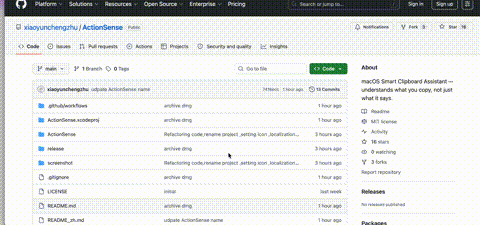

<p align="center">
  
  
  
  
  <a href="https://www.xiaoniubuniu.com/products/action-sense/"></a>
</p>

<p align="center"><b>English</b> | <a href="README_zh.md">中文</a></p>

<br>

<h1 align="center">ActionSense</h1>

<p align="center">
  <b>Clipboard Automation Engine for macOS</b><br>
  <sub>Not a clipboard manager. ActionSense understands <i>what</i> you copied — and does the next thing for you.</sub>
</p>

<p align="center">
  
</p>

<p align="center">
  <a href="https://www.xiaoniubuniu.com/products/action-sense/">
    <b>🔗 xiaoniubuniu.com/products/action-sense</b>
  </a>
</p>

<br>

---

## Why ActionSense?

Clipboard managers remember **what** you copied. ActionSense knows **what to do next**.

| Clipboard Manager | ActionSense |
|---|---|
| Stores copy history | Detects content type |
| Lets you search past items | Triggers the next action |
| You still do the work | The app does it for you |
| Ex: Paste, Maccy, Raycast Clipboard | **ActionSense** |

**Different problems, different tools.** Many ActionSense users run BOTH — a clipboard manager for history, and ActionSense for instant action.

### The moment that matters

Every time you copy something, there's a gap:

```
Copy URL        →  switch to browser  →  paste  →  Enter        (4 steps)
Copy color      →  open color picker  →  paste  →  read value   (4 steps)
Copy math expr  →  open Calculator    →  type   →  copy result   (4 steps)
```

ActionSense collapses this to:

```
Copy  →  ⌨️ Enter
```

**1 second instead of 10.** Hundreds of times a day.

---

## How It Works

```
   You copy something
          │
          ▼
┌─────────────────────┐
│  Detector Pipeline  │  10 detectors run in priority order
│  URL? Email? JSON?  │  First match wins
└─────────┬───────────┘
          │
          ▼
┌─────────────────────┐
│  Floating Panel     │  Appears at your cursor
│  ActionSense knows  │  Shows what was detected + available actions
│  it's a URL         │
│  → Open in Browser  │  Press Enter or click
└─────────┬───────────┘
          │
          ▼
┌─────────────────────┐
│  Action Executor    │  Opens browser, copies hex, formats JSON...
│  Job done           │  Panel dismisses
└─────────────────────┘
```

**All local.** Your clipboard never leaves your machine. No cloud, no analytics, no network requests.

---

## Who is this for?

### 👨‍💻 Developers

| You copy | ActionSense does |
|---|---|
| A GitHub issue URL | → Opens the issue in browser |
| `{"name":"foo","items":[1,2,3]}` | → Format or minify JSON, ready to paste |
| A hex color `#FF5733` from design specs | → Copy HEX or RGB, paste into CSS |
| A stack trace or error message | → Clean the formatting, ready to search |
| A repo URL | → Open in browser OR open in Terminal (`openRepo`) |

### 🎨 Designers

| You copy | ActionSense does |
|---|---|
| `#FF5733` from Figma | → Preview the color + copy HEX or RGB |
| `rgb(255, 87, 51)` from a style guide | → Same — both formats detected |
| A design spec URL | → Open in browser |

### 📊 Researchers & Writers

| You copy | ActionSense does |
|---|---|
| A URL with rich formatting from Safari | → Strip formatting, convert to Markdown |
| A date from a paper `2024-03-15` | → Add to Calendar |
| Coordinates `39.9042, 116.4074` | → Open in Apple Maps |
| An email address from a profile page | → Open Mail composer |

### ⚡ Power Users

ActionSense runs as a menu bar app. Enable **Plain Text Mode** and every copy is automatically stripped of formatting, CJK spacing cleaned, and whitespace normalized — without touching a shortcut.

**PasteFlow Mode** gives you the floating action panel. **Plain Text Mode** silently cleans everything. You choose per workflow.

---

## Supported Detections & Actions

| Content Type | Detection Pattern | Available Actions |
|---|---|---|
| **URL** | `https://...`, `http://...` | Open in Browser, Open Repo (GitHub/GitLab/Bitbucket) |
| **Email** | `user@domain.com` | Compose Mail |
| **Phone** | Chinese/US/International numbers | Call |
| **Color** | `#HEX`, `rgb()`, `rgba()` | Copy HEX, Copy RGB |
| **Math Expression** | `(35+47)*1.2`, `sqrt(144)` | Calculate & Copy Result |
| **JSON** | Valid JSON strings | Format (pretty-print), Minify |
| **Date/Time** | ISO dates, common formats | Add to Calendar |
| **Coordinates** | `lat, lng` decimal format | Open in Apple Maps |
| **Rich HTML** | Clipboard HTML data | Convert to Markdown, Convert to Plain Text |

---

## Detector → Action Pipeline

The architecture is designed for extension. Each content type is an independent **Detector** implementing a single protocol:

```swift
protocol ContentDetecting {
    var identifier: String { get }   // "url", "color", "json"...
    var priority: Int { get }        // detection order
    func detect(_ text: String, htmlData: Data?) -> DetectedContent?
}
```

**Register a detector → it joins the pipeline.** No switch statements, no central dispatcher to modify.

```swift
// Adding a custom detector
struct JiraTicketDetector: ContentDetecting {
    let identifier = "jira"
    let priority = 15

    func detect(_ text: String, htmlData: Data?) -> DetectedContent? {
        // Match PROJ-1234 pattern
        let pattern = /[A-Z]{2,10}-\d{1,6}/
        guard text.contains(pattern) else { return nil }
        return .jiraTicket(String(text.trimmingPrefix(pattern)))
    }
}

// One line to activate
DetectorRegistry.shared.register(JiraTicketDetector())
```

**Detectors don't know about actions. Actions don't know about detectors.** The protocol boundary keeps them decoupled — add a new content type, and it automatically becomes actionable.

---

## What's coming

The Detector → Action architecture makes ActionSense a **clipboard automation platform**, not a static tool.

| Phase | What |
|---|---|
| **Now ✅** | 10 detectors, 14 actions, Plain Text Mode, History |
| **Next** | Jira ticket detection, Slack channel links, Figma URLs, terminal commands |
| **Planned** | Custom user-defined detectors (regex → action mapping), AppleScript/Shortcuts integration |
| **Vision** | `IF clipboard matches X THEN execute Y` — a rule engine anyone can configure |

The end goal: **you define the pattern and the action. ActionSense runs it.** No coding required for basic workflows. Full Swift API for developers.

---

## Installation

### Option 1: Download DMG

Download from **[xiaoniubuniu.com/products/action-sense](https://www.xiaoniubuniu.com/products/action-sense/)**.

Open DMG → drag `ActionSense.app` to the `Applications` folder.

> **First launch:** Right-click the app → **Open**. Or go to System Settings → Privacy & Security → Open Anyway. This is a one-time Gatekeeper bypass for unsigned apps.

### Option 2: Build from Source

```bash
git clone https://github.com/xiaoyunchengzhu/ActionSense.git
cd ActionSense
open ActionSense.xcodeproj
# Product → Run (⌘R)
```

No dependencies to install. Pure Swift + SwiftUI + AppKit.

### Build DMG locally

```bash
./scripts/build_dmg.sh
```

Outputs to `release/`.

---

## Tech Stack

**SwiftUI · AppKit · MenuBarExtra · NSPasteboard · Combine · SMAppService**

- Menu bar app — zero dock space
- Floating panel at cursor with `.nonactivatingPanel` window level
- 0.5s clipboard polling via Timer + `NSPasteboard.changeCount`
- Hand-written recursive descent math parser (no `NSExpression` eval risks)
- Protocol-based detector registry with dependency injection
- 5 languages: EN, ZH-Hans, JA, FR, DE

---

## Project Structure

```
ActionSense/
├── ActionSenseApp.swift          # MenuBarExtra entry point
├── ActionSenseViewModel.swift    # State coordinator (DI-ready)
├── ClipboardMonitor.swift        # NSPasteboard polling
├── DetectorProtocol.swift        # ContentDetecting protocol + Registry
├── Detectors/
│   ├── BasicDetectors.swift      # URL / Email / Phone
│   ├── ColorDetector.swift       # Hex / RGB / RGBA parsing
│   ├── MathDetector.swift        # Recursive descent parser
│   └── TextDetectors.swift       # Date / JSON / Geo / HTML
├── ContentDetector.swift         # DetectedContent + PasteFlowAction enums
├── ActionExecutor.swift          # Action dispatcher
├── FloatingPanelView.swift       # SwiftUI panel at cursor
├── FloatingPanelController.swift # NSWindow manager
├── History/                      # Intent history + search
├── Localization.swift            # L10n with String(localized:)
└── Localizable.xcstrings         # String Catalog (en + zh-Hans)
```

---

## Contributing

New detectors are the easiest way to contribute. Pick a content type, implement the protocol, and open a PR.

See [DetectorProtocol.swift](ActionSense/DetectorProtocol.swift) for the interface and existing detectors for examples.

---

## License

MIT — see [LICENSE](LICENSE).

<p align="center">
  <sub>Built with ❤️ by <a href="https://github.com/xiaoyunchengzhu">xiaoyunchengzhu</a></sub>
</p>
