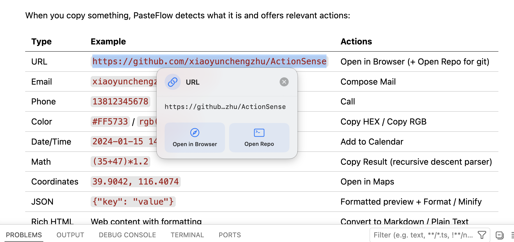
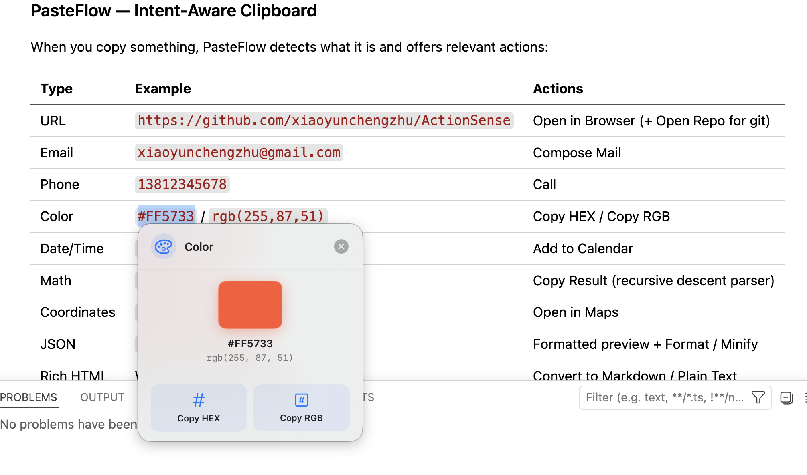
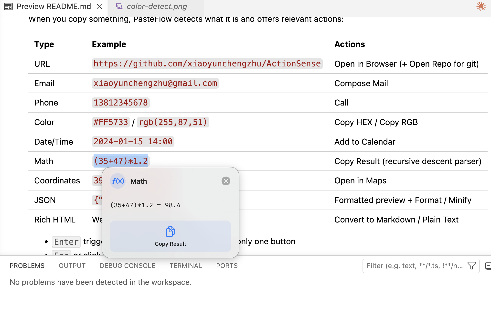
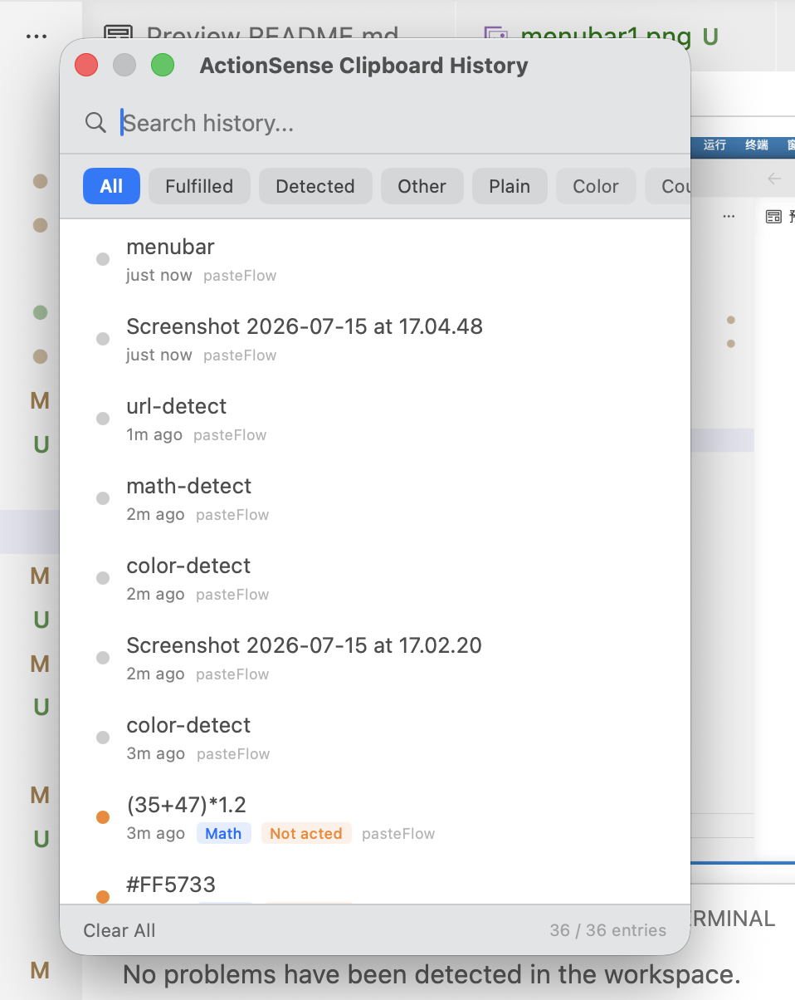

<p align="center">
  
  
  
  <a href="https://www.xiaoniubuniu.com/products/actionsense/"></a>
</p>

<p align="center"><b>中文</b> | <a href="README.md">English</a></p>

# ActionSense

<p align="center"><b>macOS 智能剪贴板助手</b> — 不只是净化格式，更是理解你的复制意图。</p>

<p align="center">
  <a href="https://www.xiaoniubuniu.com/products/actionsense/">产品页 & 下载</a>
</p>

---

## ActionSense 是什么？

ActionSense 是一个 macOS 菜单栏应用，常驻右上角，监听剪贴板变化。两个核心模式：

- **纯文本模式** — 自动剥离富文本格式，清理多余空白和 CJK 空格
- **PasteFlow 模式** — 识别复制内容的类型（URL / 邮箱 / 颜色 / 数学…），在鼠标旁弹出浮动面板，一键操作

## 为什么做这个工具

每天复制粘贴上百次，但每次复制后总要多做一步——复制 URL 要手动打开浏览器，复制颜色要看调色板，复制算式要找计算器。ActionSense 帮你在复制的瞬间自动完成这第二步。

所有处理在本地完成，数据永不上传。

## 功能详情

### PasteFlow — 意图识别

复制内容后自动检测类型，弹出对应操作：

| 类型 | 示例 | 操作 |
|------|------|------|
| 链接 | `https://www.xiaoniubuniu.com` | 浏览器打开 |
| 邮箱 | `xiaoyunchengzhu@gmail.com` | 写邮件 |
| 电话 | `13812345678` | 拨打电话 |
| 地址 | `北京市海淀区中关村南大街5号` | 地图查看 |
| IP | `192.168.1.1` | Ping |
| 颜色 | `#FF5733` / `rgb(255,87,51)` | 复制 HEX / 复制 RGB |
| 日期 | `2024-01-15 14:00` | 添加到日历 |
| 数学 | `(35+47)*1.2` | 复制结果（自研递归下降计算器） |
| 经纬度 | `39.9042, 116.4074` | 地图定位 |
| 快递 | `SF123456789012` | 查快递 |
| JSON | `{"key": "value"}` | 格式化 / 压缩 |
| Git URL | `github.com/user/repo` | 浏览器打开 + 打开仓库 |
| 富文本 | 网页复制带格式 | 转为 Markdown / 转为纯文本 |

- 单按钮面板：<kbd>Enter</kbd> 直接触发
- <kbd>Esc</kbd> 或点击面板外部关闭

### 纯文本模式

去除 RTF/HTML 格式，合并多余换行，移除 CJK 字符间多余空格，压缩连续空白。英文单词空格保留。

### 意图历史

每条剪贴板记录带完整元数据：
- 🟢 意图已完成（有操作）
- 🟠 已识别但未操作
- ⚪ 普通复制 / 未识别

支持按类型、模式、关键词筛选。最大 5000 条，本地 JSON 存储。

## 截图


### PasteFlow 智能识别

| URL 检测 | 颜色预览 | 数学计算 |
|:---:|:---:|:---:|
|  |  |  |

### 意图历史



## 安装

**方式一：源码编译（免费，无需 Apple Developer）**
```bash
git clone https://github.com/xiaoyunchengzhu/ActionSense.git
cd ActionSense
open ActionSense.xcodeproj
# Cmd+R 运行
```

**方式二：下载 DMG**
从 [xiaoniubuniu.com/products/actionsense](https://www.xiaoniubuniu.com/products/actionsense/) 下载最新版，拖到 `/Applications`。首次打开右键 → 打开，跳过 Gatekeeper。

## 项目结构

```
ActionSense/
├── ActionSenseApp.swift                # MenuBarExtra 入口
├── ActionSenseViewModel.swift        # 状态协调（支持依赖注入）
├── ClipboardMonitor.swift            # NSPasteboard 轮询（P3: 独立模块）
├── DetectorProtocol.swift            # ContentDetecting 协议 + Registry
├── Detectors/
│   ├── BasicDetectors.swift          # URL / Email / Phone / IP
│   ├── ColorDetector.swift           # 颜色解析
│   ├── MathDetector.swift            # 递归下降数学解析器
│   └── TextDetectors.swift           # 地址 / 快递 / 日期 / JSON / 经纬度 / HTML
├── ContentDetector.swift             # DetectedContent + PasteFlowAction 枚举
├── ActionExecutor.swift              # 操作分发
├── FloatingPanelView.swift           # SwiftUI 浮动面板
├── FloatingPanelController.swift     # NSWindow 管理
├── StoreManager.swift                # StoreKit 2 内购（每日限制 + Pro）
├── HistoryEntry / HistoryStore / HistoryView / HistoryWindowController
├── Localization.swift + Localizable.xcstrings  # 88 键 String Catalog
└── Info.plist + PrivacyInfo.xcprivacy + PurePaste.entitlements
```

核心设计：

- **Detector 协议化**：每个内容类型独立实现 `ContentDetecting`，启动时注册到优先级链。新增类型不修改核心代码
- **死循环防护**：`internalWriteFlag` + `lastChangeCount` 双层守卫，现在封装在 `ClipboardMonitor` 中
- **数学计算器**：手写递归下降解析器，避开 `NSExpression` 格式字符串陷阱
- **浮动面板**：`NSWindow.borderless` + `.nonactivatingPanel`，切换 App 或 5 秒无操作自动关闭（沙盒合规）
- **依赖注入**：ViewModel 通过 init 接收依赖，默认 `.shared`，可注入 mock 测试
- **历史存储**：内存过滤 + JSON 文件，无数据库依赖

## 技术栈

SwiftUI · AppKit · MenuBarExtra · NSPasteboard · Combine · SMAppService

## 局限性

- **仅支持 macOS 14.0+** — 依赖 `MenuBarExtra` 和现代 SwiftUI API
- **目前仅支持中文和英文** — 日文计划在后续版本中支持
- **无云端 / AI 功能** — 所有处理均在本地完成，这是特性而非缺陷
- **未上架 Mac App Store** — 需要 $99/年的 Apple Developer 账号进行公证
- **部分中国特有的检测**（地址关键词、快递单号）对国际用户意义不大
- **浮动面板关闭** — 切换 App 或 5 秒超时自动关闭（不使用全局鼠标监听，沙盒合规）

## 许可证

MIT — 详见 [LICENSE](LICENSE)。
